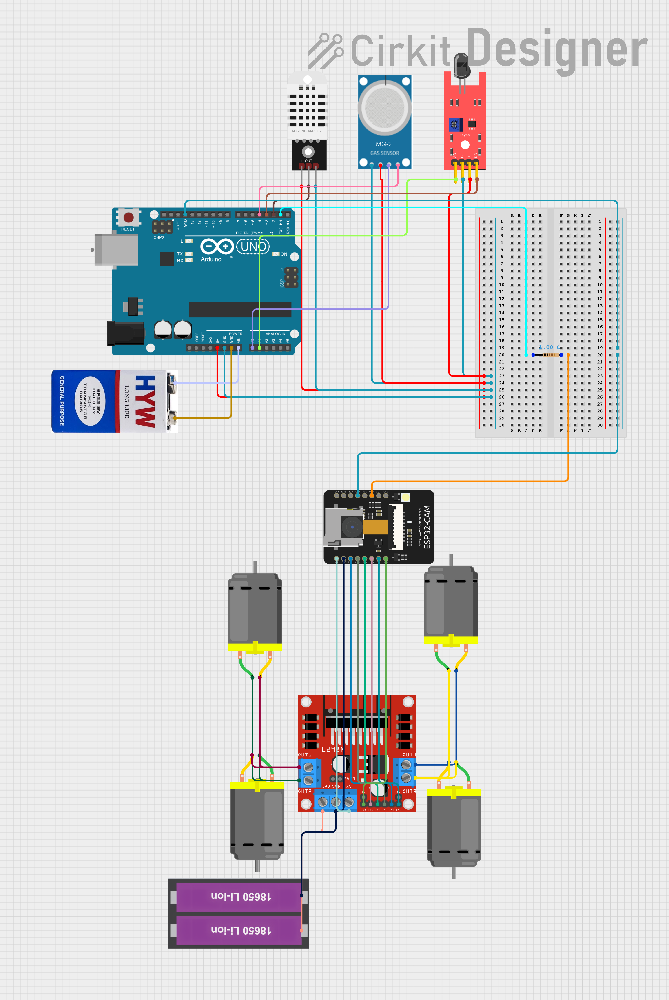

# MiniCar Control App

A mobile application for controlling a remote mini car with real-time video streaming and session history tracking.

## Features

- Remote control interface for the mini car
- Live video streaming from the car's camera
- Session history tracking
- Real-time statistics monitoring

## Prerequisites

- Node.js (version 20 or later)
- Expo CLI
- Supabase account (for backend services)

## Setup Instructions

1. Clone the repository
2. Install dependencies

   ```bash
   npm install
   ```
3. Environment Setup

   Run this command for setup environment file:

   ```bash
   cp .env.example .env
   ```

   Then reconfig your `EXPO_PUBLIC_WEBSOCKET` and `EXPO_PUBLIC_CAMERA_URL` to match your WebSocket Server and Camera Server URL
4. Start the app

   ```bash
   npx expo start
   ```

## Hardware setup


### Requirements

- 1x AI Thinker ESP32 Cam
- 1x Arduino Uno R3
- 1x DHT22 Temperature Humidity Sensor
- 1x MQ2 Gas/Smoke Sensor
- 1x KY-026 Flame Sensor
- Wires
- Batteries

Datasheet:



### Setting up

1. Navigate to [main esp32 file](arduino/esp32control.ino)
2. change hotspot wifi and password to match your desired wifi credentials
   ```c
   // Thông tin WiFi
   const char* ssid = "your_wifi_ssid";  
   const char* password = "your_wifi_password"; 
   ```
